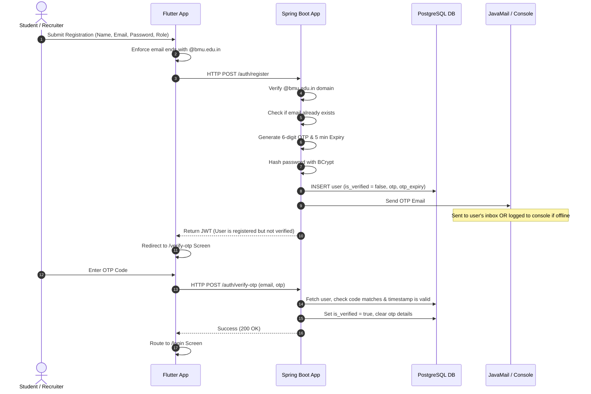

# BMU Student Placement Portal

A modern, highly aesthetic, and responsive Student Placement Portal built for BML Munjal University (BMU). This system facilitates three user roles: **Students** (to search, track, and apply for jobs), **Recruiters** (to post listings and manage applications), and **Admins** (to oversee portal operations).

The portal has been developed to prioritize high visual excellence with custom glassmorphism styling, a dark color palette, and security controls such as domain restriction and secure email verification.

---

## 🚀 Tech Stack

*   **Frontend**: Flutter Web (CanvasKit engine with a custom glassmorphic Dark Theme design system)
*   **Backend**: Spring Boot 3.x (Java 21), Spring Data JPA, Spring Security, Spring Mail
*   **Database**: PostgreSQL
*   **Authentication**: JSON Web Tokens (JWT) + BCrypt Password Hashing
*   **Email Engine**: JavaMail Sender (Gmail SMTP) with a console-logging developer fallback for offline execution

---

## 📁 Repository Structure

```text
BMU Student Portal/
├── .gitattributes                  # Directs Git to treat TTF fonts as binary to prevent corruption
├── README.md                       # Root documentation (this file)
├── placement-portal-backend/       # Spring Boot Maven web application
│   ├── src/main/java/              # Java Source Packages (Config, Security, Services, Controllers)
│   ├── src/main/resources/         
│   │   ├── schema.sql              # Database schema definitions & tables setup
│   │   └── application.properties  # Database connections, Spring Security, and Mail configuration
│   └── pom.xml                     # Maven project dependencies
└── placement-portal-frontend/      # Flutter Web application
    ├── assets/fonts/               # Local font assets (Roboto) bundled for offline fallback rendering
    ├── lib/                        
    │   ├── main.dart               # Theme setup, MaterialApp routing configuration
    │   └── views/auth/             # Glassmorphic UI Screens (Login, Signup, Forgot Password, OTP)
    ├── web/
    │   └── flutter_bootstrap.js    # CanvasKit and font fallback engine boot 
```

## 🛠️ Completed Phases

### 📌 Phase 0 — Project Setup
*   Initialized the mono-repo structure segregating the frontend and backend workspaces.
*   Scaffolded backend packages (`config`, `controller`, `dto`, `entity`, `exception`, `repository`, `security`, `service`, `util`).
*   Configured the CanvasKit engine loader in `web/flutter_bootstrap.js` to enable local execution workarounds under connection-restricted environments.

### 📌 Phase 1 — Database Design
Created a structured PostgreSQL database schema (`placement-portal-backend/src/main/resources/schema.sql`) mapping entity relationships:
*   `users`: Stores email, hashed password, role (Student, Recruiter, Admin), verification status (`is_verified`), OTP token, and token expiry.
*   `students`: Tracks student profile information associated with their `users` account.
*   `recruiters`: Tracks company profile information associated with their `users` account.
*   `jobs`: Mapped job listings containing descriptions, locations, salary packages, requirements, application deadlines, and the posting recruiter's ID.
*   `applications`: Mapped join-table representing student job applications along with status states (`APPLIED`, `UNDER_REVIEW`, `SHORTLISTED`, `INTERVIEW`, `SELECTED`, `REJECTED`).

### 📌 Phase 2 — Authentication Module
*   **JWT Backend Integration**: Implemented JWT authentication filter that checks the `Authorization: Bearer <token>` header for stateless requests. Standardized registration (`POST /auth/register`) and login (`POST /auth/login`) responses.
*   **BCrypt Hashing**: Hashing credentials at rest.
*   **Frontend UI Design**: Implemented a responsive premium design language using Glassmorphism effects.

### 📌 Phase 3 — Email Verification & Domain Restriction
*   **Strict Domain Validation**: Enforces `@bmu.edu.in` domain registration.
*   **OTP Verification Engine**: 6-digit numeric verification OTP, sent via JavaMail SMTP or printed to stdout fallback.

### 📌 Phase 4 — Student Profile Module
*   **Profile Management**: Stores branch, semester, CGPA, skills, certifications, projects, experience, GitHub, LinkedIn, and resume URLs in PostgreSQL.
*   **REST APIs**:
  - `GET /student/profile` (Retrieve profile details)
  - `PUT /student/profile` (Update profile details)

### 📌 Phase 5 — Resume Upload
*   Configured database integrations for mapping student profile resume URLs.

### 📌 Phase 6 — Job Portal
*   **Opportunity Engine**: Recruiters can post careers using `POST /jobs/create`.
*   **Student Hub**: Search dashboard listing job cards, filtering by location/skill/type, and recommended jobs matched dynamically using student profile skills.

### 📌 Phase 7 — Apply System & Student Dashboard
*   **Apply API**: Exposed `POST /apply` matching student profiles with target jobs and preventing duplicate applications.
*   **Applications Status Dashboard**: Integrated a left navigation bar layout on `student_home_screen.dart` with a dashboard tab rendering applied jobs and progress badges (APPLIED, UNDER_REVIEW, SHORTLISTED, SELECTED, REJECTED).

### 📌 Phase 8 — Application Tracking & Bookmarking
*   **Bookmarks & Saved Jobs**:
  - Implemented `POST /save-job` to toggle and `GET /saved-jobs` to fetch student bookmarks.
  - Added heart/bookmark icons to opportunity cards and the details dialog, with a dedicated Bookmarks navigation tab.
*   **Status Timeline & Recruiter Updates**:
  - Implemented `GET /recruiter/applications` to retrieve applicant data with candidate profile info.
  - Implemented `PATCH /application/status` for recruiters to transition application states.
  - Designed a horizontal visual progression timeline stepper on student application cards indicating statuses: `Applied` ➔ `Review` ➔ `Shortlist` ➔ `Interview` ➔ `Outcome`.

### 📌 Phase 9 — Admin Dashboard & Announcement Module
*   **System Statistics Analytics**: Added dynamic total metrics panel tracking students, recruiters, and opportunities in the system.
*   **Recruiter Verification Approvals**: Admins can verify/unverify recruiter users using toggle switches, locking/unlocking their privileges.
*   **Student Profile Database**: Exposed a detailed read-only list view of students with branches, semesters, and CGPA metrics.
*   **Announcement Module**:
  - Admin form to post notices dynamically categorized as `Hackathons`, `Seminars`, `Workshops`, or `Notice`.
  - Created global announcement feed pages integrated across Student, Recruiter, and Admin dashboards showing category-colored badges and descriptions.

---

## 🎨 Global UI Theme Redesign
The portal was redesigned to conform to a modern, premium dark SaaS interface:
*   **Scaffold Background**: Deep Slate Navy (`#0A0E17`)
*   **Translucent Surface**: Dark Slate Gray (`#111827`)
*   **Input Fields Fill**: Dark Navy (`#1F2937`)
*   **Primary Accent**: Electric Teal (`#14B8A6`)
*   **Secondary Accent**: Cool Tech Blue (`#3B82F6`)

---

## 🔒 Security Flow Architecture



---

## 🏁 Getting Started

### Prerequisites
*   **Java JDK 21**
*   **Apache Maven 3.9+**
*   **PostgreSQL**
*   **Flutter SDK** (Web support enabled)

### 1. Database Initialization
Create a new PostgreSQL database instance named `placement_portal`:
```sql
CREATE DATABASE placement_portal;
```

Update config settings in `placement-portal-backend/src/main/resources/application.properties`:
```properties
spring.datasource.url=jdbc:postgresql://localhost:5432/placement_portal
spring.datasource.username=your_postgres_user
spring.datasource.password=your_postgres_password
```

### 2. Launch the Backend API
Navigate to the backend directory and compile/run the application:
```bash
cd placement-portal-backend
mvn spring-boot:run
```

### 3. Launch the Frontend Application
Navigate to the frontend directory, resolve dependencies, and start the development server targeting Google Chrome:
```bash
cd placement-portal-frontend
flutter pub get
flutter run -d chrome
```

---

## ⚙️ REST API Endpoints

### Authentication
| Method | Endpoint | Description | Payload Example |
| :--- | :--- | :--- | :--- |
| **POST** | `/auth/register` | Registers a new account, generates an OTP, and sends a verification email. | `{"email": "test@bmu.edu.in", "password": "pass", "role": "STUDENT", "name": "Aryan"}` |
| **POST** | `/auth/login` | Log in to an account. | `{"email": "test@bmu.edu.in", "password": "pass"}` |
| **POST** | `/auth/send-otp` | Generates a fresh 6-digit OTP code and updates the user's expiration window. | `{"email": "test@bmu.edu.in"}` |
| **POST** | `/auth/verify-otp` | Validates the verification code. Sets user as verified. | `{"email": "test@bmu.edu.in", "otp": "123456"}` |
| **POST** | `/auth/forgot-password` | Simulates sending password reset instructions. | `{"email": "test@bmu.edu.in"}` |

### Student Profile
| Method | Endpoint | Description | Payload Example |
| :--- | :--- | :--- | :--- |
| **GET** | `/student/profile` | Fetches student profile. | *(Requires Bearer Token)* |
| **PUT** | `/student/profile` | Updates student profile details. | `{"name": "Aryan", "branch": "CSE", "semester": 6, "cgpa": 9.2, "skills": "Java, Flutter"}` |

### Job Opportunities
| Method | Endpoint | Description | Payload Example |
| :--- | :--- | :--- | :--- |
| **POST** | `/jobs/create` | Posts a new job listing (Recruiter only). | `{"role": "SDE Intern", "description": "...", "location": "Delhi", "salary": "12 LPA", "type": "Internship"}` |
| **GET** | `/jobs` | Searches and filters jobs case-insensitively. | `GET /jobs?skill=java&location=Delhi` |
| **GET** | `/jobs/recruiter` | Fetches postings created by the current logged-in recruiter. | *(Requires Recruiter Bearer Token)* |

### Applications
| Method | Endpoint | Description | Payload Example |
| :--- | :--- | :--- | :--- |
| **POST** | `/apply` | Applies student profile to job. | `{"jobId": 1}` |
| **GET** | `/student/applications` | Fetches student's job applications and status updates. | *(Requires Student Bearer Token)* |
| **GET** | `/recruiter/applications` | Fetches applications submitted to recruiter's jobs with candidate metrics. | *(Requires Recruiter Bearer Token)* |
| **PATCH** | `/application/status` | Recruiter updates application status. | `{"applicationId": 1, "status": "SHORTLISTED"}` |

### Bookmarks
| Method | Endpoint | Description | Payload Example |
| :--- | :--- | :--- | :--- |
| **POST** | `/save-job` | Bookmarks/unbookmarks a job listing. | `{"jobId": 1}` |
| **GET** | `/saved-jobs` | Fetches student's bookmarked jobs. | *(Requires Student Bearer Token)* |

### Admin & Announcements (Phase 9)
| Method | Endpoint | Description | Payload Example |
| :--- | :--- | :--- | :--- |
| **GET** | `/admin/stats` | Fetches total student, recruiter, and job counts. | *(Requires Admin Bearer Token)* |
| **GET** | `/admin/recruiters` | Fetches all recruiter profiles and verification status. | *(Requires Admin Bearer Token)* |
| **POST** | `/admin/recruiters/{id}/verify` | Updates verification status of a recruiter. | `POST /admin/recruiters/1/verify?verified=true` *(Requires Admin Bearer Token)* |
| **GET** | `/admin/students` | Fetches student list. | *(Requires Admin Bearer Token)* |
| **POST** | `/announcement` | Creates a global announcement. | `{"title": "[Hackathon] Cyber Hack", "description": "Details..."}` *(Requires Admin Bearer Token)* |
| **GET** | `/announcements` | Fetches global announcements feed in descending date order. | *(Requires Bearer Token)* |

---

## 🛠️ Offline & Asset Rendering Workarounds
1.  **CanvasKit Load Failure**: CanvasKit WASM file loading is bypassed internally by saving CanvasKit dependencies locally and linking them via `canvasKitBaseUrl: "canvaskit/"` inside `flutter_bootstrap.js`.
2.  **Font Resolution Failure**: Roboto fonts are bundled locally under `assets/fonts/` and registered under `pubspec.yaml` to prevent font fetching timeouts in offline environments. In addition, Git configurations in the root `.gitattributes` file enforce `*.ttf binary` checks to ensure these binary fonts do not corrupt during Windows CRLF checkouts.
