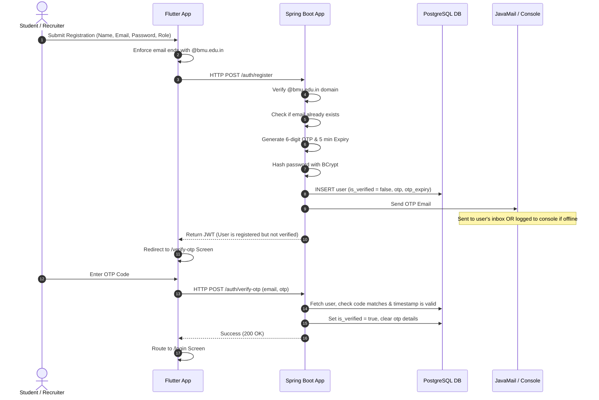

# BMU Student Placement Portal

A modern, highly aesthetic, and responsive Student Placement Portal built for BML Munjal University (BMU). This system facilitates three user roles: **Students** (to search, track, and apply for jobs), **Recruiters** (to post listings and manage applications), and **Admins** (to oversee portal operations).

The portal has been developed to prioritize high visual excellence with custom glassmorphism styling, a dark color palette, and security controls such as domain restriction and secure email verification.

---

## 🚀 Tech Stack

*   **Frontend**: Flutter Web (CanvasKit engine with a custom glassmorphic Dark Theme design system)
*   **Backend**: Spring Boot 3.x (Java 21), Spring Data JPA, Spring Security, Spring Mail
*   **Database**: PostgreSQL
*   **Authentication**: JSON Web Tokens (JWT) + BCrypt Password Hashing
*   **Email Engine**: JavaMail Sender (Gmail SMTP) with a console-logging developer fallback for offline execution

---

## 📁 Repository Structure

```text
BMU Student Portal/
├── .gitattributes                  # Directs Git to treat TTF fonts as binary to prevent corruption
├── README.md                       # Root documentation (this file)
├── placement-portal-backend/       # Spring Boot Maven web application
│   ├── src/main/java/              # Java Source Packages (Config, Security, Services, Controllers)
│   ├── src/main/resources/         
│   │   ├── schema.sql              # Database schema definitions & tables setup
│   │   └── application.properties  # Database connections, Spring Security, and Mail configuration
│   └── pom.xml                     # Maven project dependencies
└── placement-portal-frontend/      # Flutter Web application
    ├── assets/fonts/               # Local font assets (Roboto) bundled for offline fallback rendering
    ├── lib/                        
    │   ├── main.dart               # Theme setup, MaterialApp routing configuration
    │   └── views/auth/             # Glassmorphic UI Screens (Login, Signup, Forgot Password, OTP)
    ├── web/
    │   └── flutter_bootstrap.js    # CanvasKit and font fallback engine boot settings
    └── pubspec.yaml                # Frontend package dependencies & font assets configuration
```

---

## 🛠️ Completed Phases (Up to Phase 3)

### 📌 Phase 0 — Project Setup
*   Initialized the mono-repo structure segregating the frontend and backend workspaces.
*   Scaffolded backend packages (`config`, `controller`, `dto`, `entity`, `exception`, `repository`, `security`, `service`, `util`).
*   Configured the CanvasKit engine loader in `web/flutter_bootstrap.js` to enable local execution workarounds under connection-restricted environments.

### 📌 Phase 1 — Database Design
Created a structured PostgreSQL database schema (`placement-portal-backend/src/main/resources/schema.sql`) mapping entity relationships:
*   `users`: Stores email, hashed password, role (Student, Recruiter, Admin), verification status (`is_verified`), OTP token, and token expiry.
*   `students`: Tracks student profile information (name, branch, semester, CGPA, skills, GitHub/LinkedIn URLs, resume link) associated with their `users` account.
*   `recruiters`: Tracks company profile information (company name, website, verification status) associated with their `users` account.
*   `jobs`: Mapped job listings containing descriptions, locations, salary packages, requirements, application deadlines, and the posting recruiter's ID.
*   `applications`: Mapped join-table representing student job applications along with status states (`APPLIED`, `UNDER_REVIEW`, `SHORTLISTED`, `INTERVIEW`, `SELECTED`, `REJECTED`).
*   `resume_scores`: Automated resume parser score values and feedback suggestions.
*   `saved_jobs`: Bookmarked listings created by students.
*   `announcements`: General portal announcements and notifications.

### 📌 Phase 2 — Authentication Module
*   **JWT Backend Integration**: Implemented JWT authentication filter (`JwtAuthenticationFilter`) that checks the `Authorization: Bearer <token>` header for stateless requests. Standardized registration (`POST /auth/register`) and login (`POST /auth/login`) responses to issue JWTs.
*   **BCrypt Hashing**: Integrated Spring Security password encoder hashing credentials at rest.
*   **Frontend UI Design**: Implemented a responsive premium design language using:
    *   **Glassmorphism Effects**: Translucent overlay cards with fine borders and drop shadows.
    *   **Color Palette**: Deep dark space backgrounds (`#0F0C1B`) contrasted with neon Indigo (`#6366F1`) and Purple (`#8B5CF6`) gradients.
    *   **Screens**: Interactive forms for login, role-specific registration (STUDENT/RECRUITER fields toggle), and forgot password recovery.

### 📌 Phase 3 — Email Verification & Domain Restriction
*   **Strict Domain Validation**: Implemented email checks enforcing that only BML Munjal University email addresses (`@bmu.edu.in`) can register or log in. This validation is run consistently on both the Flutter client and the Spring Boot API.
*   **OTP Verification Engine**: Added fields to database tables to store OTP and token expiration timestamps (5-minute expiration window).
*   **JavaMail Integration**: Added support for sending OTP verification messages using SMTP.
    *   *Developer Console Fallback*: When SMTP credentials are not specified in the environment variables, the backend logs the generated verification code directly to the Spring Boot standard output console (e.g. `TO: target@bmu.edu.in | OTP: 123456`), allowing seamless offline testing.
*   **OTP Screen Implementation**: Created `otp_verification_screen.dart` featuring a custom 6-digit numeric verification layout, validation feedback, and an interactive 30-second resend countdown timer. If a user attempts to log in with an unverified account, they are automatically routed to the OTP screen to verify.

---

## 🔒 Security Flow Architecture



---

## 🏁 Getting Started

### Prerequisites
*   **Java Development Kit (JDK) 21**
*   **Apache Maven 3.9+**
*   **PostgreSQL** (running locally or remotely)
*   **Flutter SDK** (Stable channel, Web support enabled)
*   **Google Chrome** (for testing the Web frontend)

### 1. Database Initialization
Create a new PostgreSQL database instance named `placement_portal`:
```sql
CREATE DATABASE placement_portal;
```

Update the configuration in [application.properties](file:///c:/Users/ARYAN%20BHUTANI/Desktop/BMU%20Student%20Portal/placement-portal-backend/src/main/resources/application.properties):
```properties
spring.datasource.url=jdbc:postgresql://localhost:5432/placement_portal
spring.datasource.username=your_postgres_user
spring.datasource.password=your_postgres_password
```

### 2. Configure Email/SMTP Settings (Optional)
To enable real email dispatch for OTP codes, set the following environment variables on your system:
*   `SPRING_MAIL_USERNAME`: Your Gmail address (e.g. `example@gmail.com`)
*   `SPRING_MAIL_PASSWORD`: Your 16-character Google App Password (generated via Google Account settings)

*If these environment variables are absent, the application runs in offline developer mode, printing OTP codes directly to the console output.*

### 3. Launch the Backend API
Navigate to the backend directory and compile/run the application:
```bash
cd placement-portal-backend
mvn spring-boot:run
```
*(Upon running, Hibernate automatically sets up and drops/recreates tables defined in `schema.sql`).*

### 4. Launch the Frontend Application
Navigate to the frontend directory, resolve dependencies, and start the development server targeting Google Chrome:
```bash
cd placement-portal-frontend
flutter pub get
flutter run -d chrome
```

---

## ⚙️ REST API Endpoints (Auth Module)

| Method | Endpoint | Description | Payload Example |
| :--- | :--- | :--- | :--- |
| **POST** | `/auth/register` | Registers a new account, generates an OTP, and sends a verification email. | `{"email": "test@bmu.edu.in", "password": "pass", "role": "STUDENT", "name": "Aryan"}` |
| **POST** | `/auth/login` | Log in to an account. Throws an exception if the email is not verified yet. | `{"email": "test@bmu.edu.in", "password": "pass"}` |
| **POST** | `/auth/send-otp` | Generates a fresh 6-digit OTP code and updates the user's expiration window. | `{"email": "test@bmu.edu.in"}` |
| **POST** | `/auth/verify-otp` | Validates the verification code. Sets user as verified. | `{"email": "test@bmu.edu.in", "otp": "123456"}` |
| **POST** | `/auth/forgot-password` | Simulates sending password reset instructions. | `{"email": "test@bmu.edu.in"}` |

---

## 🛠️ Offline & Asset Rendering Workarounds
During local development, two major rendering issues were resolved:
1.  **CanvasKit Load Failure**: CanvasKit WASM file loading is bypassed internally by saving CanvasKit dependencies locally and linking them via `canvasKitBaseUrl: "canvaskit/"` inside `flutter_bootstrap.js`.
2.  **Font Resolution Failure**: Roboto fonts are bundled locally under `assets/fonts/` and registered under `pubspec.yaml` to prevent font fetching timeouts in offline environments. In addition, Git configurations in the root [.gitattributes](file:///.gitattributes) file enforce `*.ttf binary` checks to ensure these binary fonts do not corrupt during Windows CRLF checkouts.
